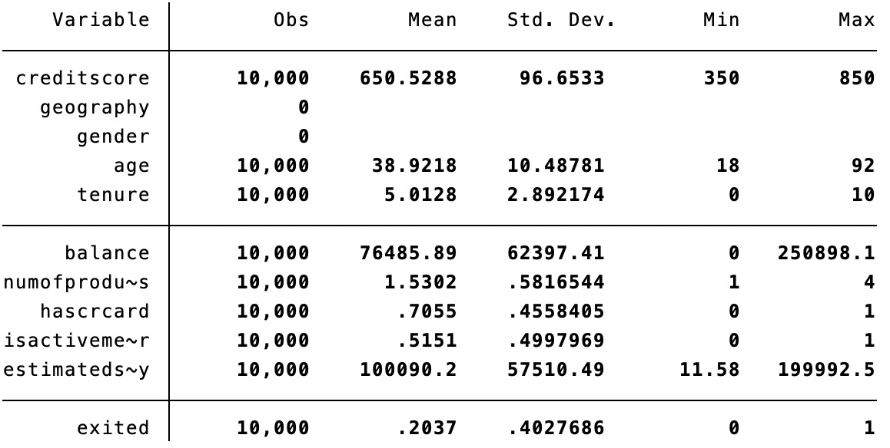
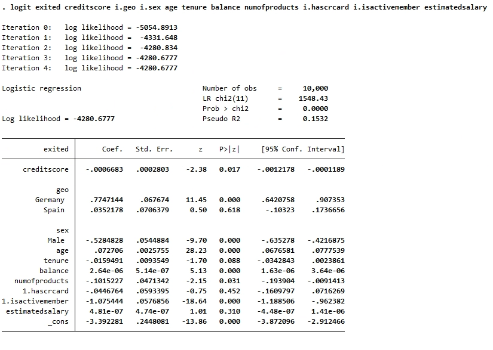
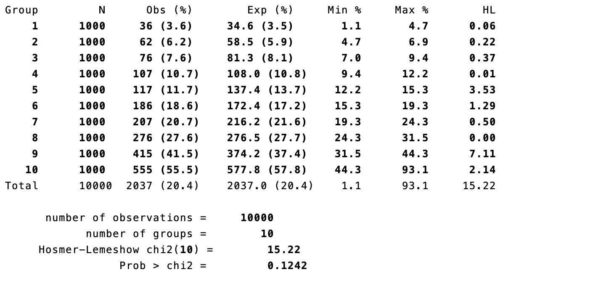
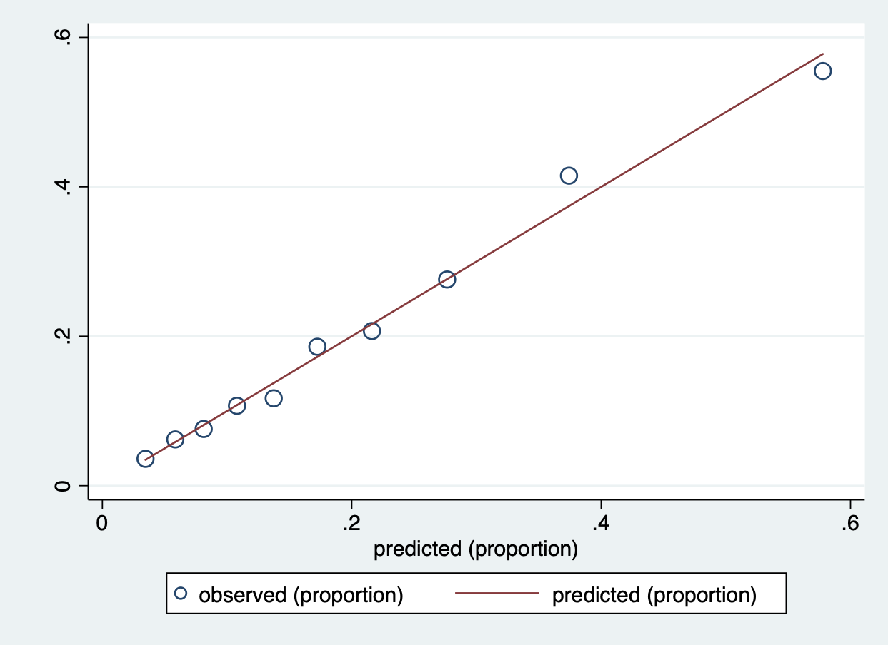
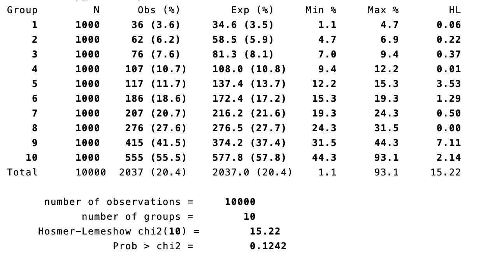

```{css, include = TRUE, echo = FALSE}
body{ /* Normal */
  font-size: 15px;
}
td{ /* Table  */
  font-size: 14px;
}
#TOC{ /* Table of contents */
  font-size: 16px;
}
h2{ /* Header 2 */
  font-size: 28px;
}
h3{ /* Header 3 */
  font-size: 22px;
}
h5{ /* Header 5 */
  font-size: 18px;
  text-decoration: underline;
}
h6{ /* Header 6 */
  font-size: 16px;
  font-weight: bold;
}
.highlight{ /* Highlighted Text */
  background-color: #d8e8e8;
}
span.math{ /* Formulas */
  font-size: 13px;
}
blockquote {
  font-size: 15px;
}
pre { /* Scrollable code block */
  max-height: 300px;
  overflow-y: auto;
}
.plotly{ /* Figures generated with plotly - align center */
  display: block;
  margin-left: auto;
  margin-right: auto;
}
```

```{r setup, include=TRUE}
# 79: -------------------------------------------------------------------------
knitr::opts_chunk$set(echo = TRUE)
```

# Introduction

The purpose of this tutorial is to introduce the Hosmer-Lemeshow Test, which is
a goodness of fit test for logistic regression models. We will first introduce
the key concepts behind logistic regression models and the Hosmer-Lemeshow Test.
Then we will use a bank churn data to illustrate how to perform Hosmer-Lemeshow
test and create Hosmer-Lemeshow plot in **R** and **Stata**. Eventually we will
compare the result to a likelihood based approach like AIC and explain the
potential limitations with the HL test.

## Logistic Regression Model

Logistic regression is a statistical model that in its basic form uses a
logistic function to model a binary response variable. In our example, the
response variable will be whether the customer churn or not. Let's denote the
response variable to have value 0 or 1 in our case.
The logistic model predicts $P(Y=1) = \frac{1}{1+exp(\beta'x)}$, so $P(Y=0) = \frac{exp(\beta'x)}{1+exp(\beta'x)}$.

## Hosmer-Lemeshow Test

The Hosmer-Lemeshow Test assesses whether or not the observed event rates match
expected event rates in subgroups of the model population. The Hosmer–Lemeshow
test statistic is given by:  
$$H = \sum_{g=1}^{G}\frac{(O_{1g}-E_{1g})^2}{N_g\pi_g(1-\pi_g)}$$  
, where $O_{1g}$, $E_{1g}$, $O_{0g}$, $E_{0g}$, $N_g$, and $π_g$ denote the
observed $Y=1$ events, expected $Y=1$ events, observed $Y=0$ events, expected
$Y=0$ events, total observations, predicted risk for the $g^{th}$ risk decile
group, and G is the number of groups. The test statistic asymptotically follows
a $\chi ^{2}$ distribution with G − 2 degrees of freedom. For the HL test, the
null hypothesis is that the observed and expected proportions are the same
across subgroups, which indicates a good fit model.

## Data Description
We will use the bank churn data available on Kaggle([ Data Source](https://www.kaggle.com/shrutimechlearn/churn-modelling)).
The data contains 10000 observations of 14 variables of which 2000 are postivie observations. For simplicity, we only
construct the logistic model using the variables below:  
`Credit Score`: The credit score of the customer, ranging from 350 to 850  
`Geography`: The country where the customer belongs. There are only three
countries in our case, which are Germany, France and Spain.  
`Gender`: Gender  
`Age`: Age   
`Tenure`: Number of years for which the customer has been with the bank  
`Balance`: Bank balance of the customer  
`HasCrCard`: Binary Flag for whether the customer holds a credit card with the
bank or not.  
`IsActiveMember`: Binary Flag for whether the customer is an active member with
the bank or not.  
`EstimatedSalary`: Estimated salary of the customer in Dollars.  
`Exited`: The response variable indicated whether the customer churn or not. 1
means customer exited and 0 means retained.

# Data Visualization

```{r message=FALSE, warning=FALSE}
library(tidyverse)
library(ggplot2)
library(readr)
library(ResourceSelection)
# data: -----------------------------------------------------------------------
path = "./data"
file_name = sprintf('%s/Churn_Modelling_Cleaned.csv', path)
data = read_csv(file_name)
# factoring: ------------------------------------------------------------------
#names(data)
data = data %>% mutate(Exited = as.factor(Exited),
                       HasCrCard = as.factor(HasCrCard),
                       IsActiveMember = as.factor(IsActiveMember))
#summary(data)
#head(data)

```

* Figure.1 The distribution of credit score by exited

```{r}
data %>% ggplot(aes( CreditScore,color = Exited )) + geom_density()
```


* Figure.2 Age + Gender ~ Exited

```{r}
data %>% ggplot(aes(x = Exited, y = Age, color = Gender)) + geom_boxplot()
```


* Figure.3 Geography ~ Exited

```{r}
data %>% ggplot(aes(x = Geography, y = Exited)) + geom_count()
```


* Figure.4 HasCrCard ~ Exited  

```{r}
data %>% ggplot(aes(x = Exited, y = HasCrCard, color = Gender)) +geom_count()
```

# Model fitting {.tabset}

## R {.tabset}

### Setup
```{r  paged.print=TRUE}
data = data %>% mutate(Exited = as.factor(Exited),
                       HasCrCard = as.factor(HasCrCard),
                       IsActiveMember = as.factor(IsActiveMember))
# modeling: -------------------------------------------------------------------
model1 = glm(Exited ~ ., data = data, family = binomial(link="logit"))
summary(model1)
# Hosmer-Lemeshow Goodness of Fit Test: ---------------------------------------
hoslem.test(model1$y, model1$fitted.values, g = 10)
```

## Stata {.tabset}

### Setup
In Stata, there are built-in functions called
[lfit](https://stats.idre.ucla.edu/stata/webbooks/logistic/chapter3/lesson-3-logis
tic-regression-diagnostics/) and [estat
gof](https://www.stata.com/manuals13/restatgof.pdf) for performing Hosmer-Lemeshow
test. However, in order to make HL plot for model calibration, we will first
install the hl packages from [sealedenvelope](https://www.sealedenvelope.com/).

```
net from https://www.sealedenvelope.com/
net describe hl
net install hl

```

### Loading data
```
import delimited Churn_Modelling_Cleaned.csv
summarize
save churn_data.dta, replace
clear
```
We first load in the data and use `summarize` to produce an overview of the
data

  

### Fitting logistic model
Before we fit an logistic model, we must notice that stata doesn't know how to 
handle string variables for regression. One way to solve this is to use `encode`
command. In our case, we use it to convert variables geography and gender.  
```
use churn_data
encode geography, gen(geo)
encode gender, gen(sex)
```

Then we use `logit` function to built the logistic regression model with
`exited` as response variable and others as predictors.

```
logit exited creditscore i.geo i.sex age tenure balance numofproducts i.hascrcard i.isactivemember estimatedsalary

```
The result is presented below.   



### Hosmer-Lemeshow Test and calibration plot

For a HL test statistics, we can just use `lfit` or `estat gof` commands.
In our case, we will use `hl` command that enables us to create calibration 
plot. Unlike `lfit` or `estat gof`, `hl` command requires us to store predicted 
value in a variable. We will name it `p_exited` here. Then we can use the
command `hl exited p_exited, plot` to obtain the test result and calibration
plot. Note that the `, plot` command is optional.
Below is the result of the HL test and calibration plot.  

  

.   

We see the the test statistics for the HL test is 0.1242 > 0.05, so we failed
to reject null hypothesis, indicating the model is well fitted.
The plot also shows that the observed value(bubbles) are well fitted on the
line.

### Compare with likelihood based approach(AIC)
We will try to use a likelihood based approach(AIC) and backward elimination 
method to do variable selection. Then we will construct an optimized model and 
compare the HL test result with the previous result. The `estat ic` command
helps us to find the AIC for the model. The AIC for our current model is 
8585.355.  
.  

Then we eliminate HasCrCard, which has the highest p-value. The AIC for the new
model is 8583.921.   
  

Proceed this procedure, we eliminate EstimatedSalary and the resulting AIC is 
8582.953.   

  

Now we reached our final model and we will then repeat the process of
performing HL test and calibration plot again.

### HL test and calibration plot for new model
We will first present the result.   
  

  

We can observe that the new statistics become 0.2164, which is an improved
model and coincides with the AIC approach.

# Brief Summary

The logistic regression performed in R and Stata yield the same result. Hosmer and Lemeshow goodness of fit also give the same result. This is what we expected as we used exactly the same model though different software.

# Timeline

* Add more example and compare different models (Nov 20)


# References
[Logistic Model](https://en.wikipedia.org/wiki/Logistic_regression)  
[Hosmer-Lemeshow Test](https://en.wikipedia.org/wiki/Hosmer%E2%80%93Lemeshow_test#Pearson_chi-squared_goodness_of_fit_test)


