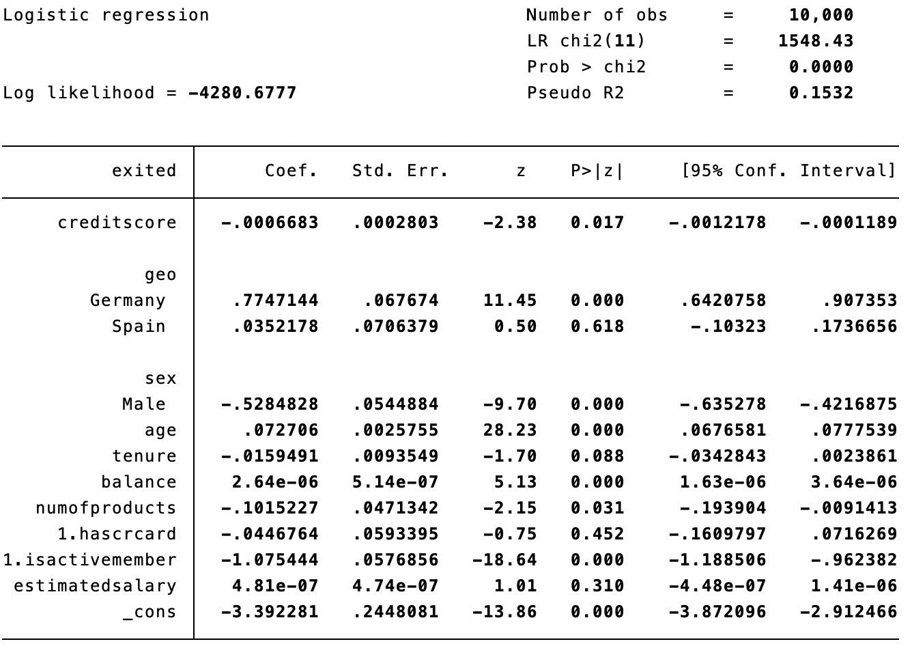
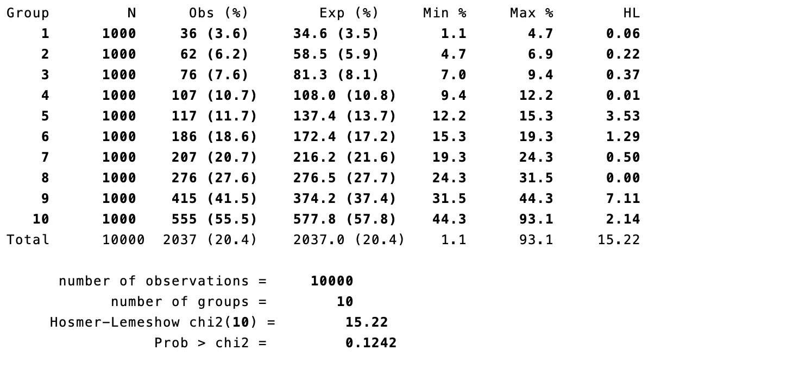
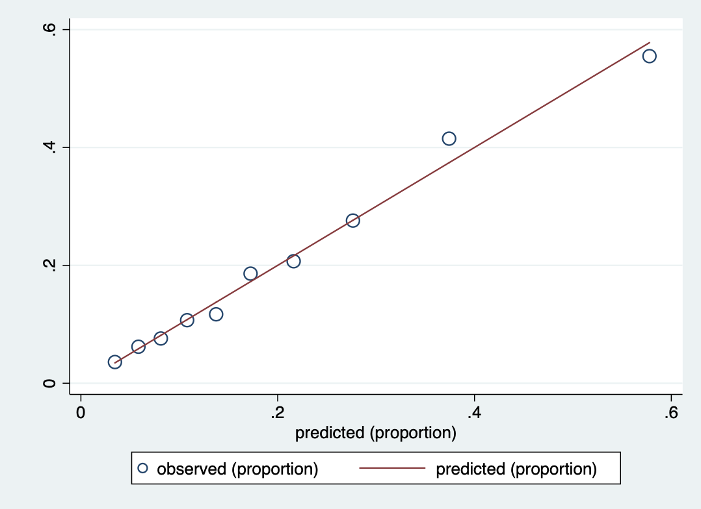

```{css, include = TRUE, echo = FALSE}
body{ /* Normal */
  font-size: 15px;
}
td{ /* Table  */
  font-size: 14px;
}
#TOC{ /* Table of contents */
  font-size: 16px;
}
h2{ /* Header 2 */
  font-size: 28px;
}
h3{ /* Header 3 */
  font-size: 22px;
}
h5{ /* Header 5 */
  font-size: 18px;
  text-decoration: underline;
}
h6{ /* Header 6 */
  font-size: 16px;
  font-weight: bold;
}
.highlight{ /* Highlighted Text */
  background-color: #d8e8e8;
}
span.math{ /* Formulas */
  font-size: 13px;
}
blockquote {
  font-size: 15px;
}
pre { /* Scrollable code block */
  max-height: 300px;
  overflow-y: auto;
}
.plotly{ /* Figures generated with plotly - align center */
  display: block;
  margin-left: auto;
  margin-right: auto;
}
```

```{r setup, include=FALSE}
knitr::opts_chunk$set(echo = TRUE)
```

# Introduction

The purpose of this tutorial is to introduce the Hosmer-Lemeshow Test, which is
a goodness of fit test for logistic regression models. We will first introduce
the key concepts behind logistic regression models and the Hosmer-Lemeshow
Test.
Then we will use a bank churn data to illustrate how to perform Hosmer-Lemeshow
test and create Hosmer-Lemeshow plot. Eventually we will
compare the result to a likelihood based approach like AIC and explain the
potential limitations with the HL test. We will provide step-by-step procedures
in both **R** and **Stata**.

## Logistic Regression Model

Logistic regression is a statistical model that in its basic form uses a
logistic function to model a binary response variable. In our example, the
response variable will be whether the customer churn or not. Let's denote the
response variable to have value 0 or 1 in our case.
The logistic model predicts $P(Y=1) = \frac{1}{1+exp(\beta'x)}$, 
so $P(Y=0) =\frac{exp(\beta'x)}{1+exp(\beta'x)}$.

## Hosmer-Lemeshow Test

The Hosmer-Lemeshow test (HL test) is a goodness of fit test for logistic regression, especially for risk prediction models. Specificially, HL test assesses whether or not the observed event rates match
expected event rates in subgroups of the model population. This test is only used for binary response varibales(exited or retained in this example). 

The Hosmer–Lemeshow
test statistic is given by:  
$$H = \sum_{g=1}^{G}\frac{(O_{1g}-E_{1g})^2}{N_g\pi_g(1-\pi_g)}$$  
where $O_{1g}$, $E_{1g}$, $O_{0g}$, $E_{0g}$, $N_g$, and $π_g$ denote the
observed $Y=1$ events, expected $Y=1$ events, observed $Y=0$ events, expected
$Y=0$ events, total observations, predicted risk for the $g^{th}$ risk decile
group, and G is the number of groups. The test statistic asymptotically follows
a $\chi ^{2}$ distribution with G − 2 degrees of freedom. 

For the HL test, the null hypothesis is that the observed and expected proportions are the same
across subgroups, which indicates a good fit model. Like most goodness of fit tests, small p-values indicate a poor fit. 

## Data Description

We will use the bank churn data available from Kaggle([ Data Source](https://www.kaggle.com/shrutimechlearn/churn-modelling)).
The data contains 10000 observations of 14 variables of which 2000 are positive observations. For simplicity, we only construct the logistic model using the variables below: 

* `Credit Score`: The credit score of the customer, ranging from 350 to 850.  

* `Geography`: The country where the customer belongs, including Germany, France and Spain.  

* `Gender`: Female or Male.

* `Age`:  Age of the customer.

* `Tenure`: Number of years for which the customer has been with the bank.  

* `Balance`: Bank balance of the customer.  

* `NumOfProducts`: Number of bank products the customer is utilising.

* `HasCrCard`: Binary Flag for whether the customer holds a credit card with the
bank or not.  

* `IsActiveMember`: Binary Flag for whether the customer is an active member with
the bank or not.  

* `EstimatedSalary`: Estimated salary of the customer in Dollars. 

* `Exited`: The response variable indicated whether the customer churn or not. 1
means customer exited and 0 means retained.

## Software/Tools

In this tutorial, we are using R and STATA to show how Logistic Regression and Hosmer-Lemeshow Test could be implemented. 

Software| Relevant Libraries
------------ | ------------------------------------------------------------
R |  `tidyverse` (data manipulation), `jtools` (model summary), `ResourceSelection` (Hosmer-Lemeshow Goodness Of Fit test), `modEvA` (Hosmer-Lemeshow plot)
STATA | `hl` (Hosmer-Lemeshow Goodness Of Fit test)

# Data Visualization

```{r message=FALSE, warning=FALSE}

library(tidyverse)
library(jtools) # For printing model summary
library(ResourceSelection) # For Hosmer-Lemeshow Goodness Of Fit test
library(modEvA) # For Hosmer-Lemeshow plot

path = "./data"
file_name = sprintf('%s/Churn_Modelling_Cleaned.csv', path)
data = read.csv(file_name)

data = data %>% mutate(Exited = as.factor(Exited),
                       HasCrCard = as.factor(HasCrCard),
                       IsActiveMember = as.factor(IsActiveMember))
```

* Figure 1 shows the distributions of credit score and estimated salary stratified by the response variable `Exited` status. There is no vast difference between these two groups in terms of the credit scores distribution and estimated salary.

```{r}
data %>% 
  ggplot(aes( CreditScore, color = Exited )) + 
  geom_density() + 
  ggtitle("Figure.1.1 The distribution of credit score by exited") +
  theme_bw()
```

```{r}
data %>% 
  ggplot(aes( EstimatedSalary, color = Exited )) + 
  geom_density() + 
  ggtitle("Figure.1.2 The distribution of estimated salary by exited") +
  theme_bw()
```

```{r}
data %>% 
  ggplot(aes( Balance, color = Exited )) + 
  geom_density() + 
  ggtitle("Figure.1.3 The distribution of balance by exited") +
  theme_bw()
```

* Figure 2 indicates that exited customers have a higher mean age than those retained. There is no significant difference in gender between the exited and retained groups.

```{r}
data %>% 
  ggplot(aes(x = Exited, y = Age, color = Gender)) + 
  geom_boxplot() + 
  ggtitle("Figure.2 Age + Gender ~ Exited") +
  theme_bw()
```


* Figure 3 shows the geographic information of the customers. It seems that the proportion of churn is much higher in Germany than that in France.

```{r}
data %>% 
  ggplot(aes(x = Exited)) + 
  geom_bar() + 
  facet_grid(~ Geography) +
  ggtitle("Figure.3 Geography ~ Exited") +
  theme_bw()
```


* Female has a higher rate of churn in this data set.

```{r}
data %>% 
  ggplot(aes(x = Exited)) +
  geom_bar() + 
  facet_grid(  ~ Gender) +
  ggtitle("Figure.4 Gender ~ Exited") +
  theme_bw()
```

# Model fitting {.tabset}

## R 

In this model fitting part, we will fit a logistic regression to the bank churn dataset. 

### Setup

We started with a full model with all the predictors. 

```{r  paged.print=TRUE}
data = data %>% mutate(Exited = as.factor(Exited),
                       HasCrCard = as.factor(HasCrCard),
                       IsActiveMember = as.factor(IsActiveMember))
# modeling
model1 = glm(Exited ~ ., data = data, family = binomial(link="logit"))
summ(model1)
```

From this preliminary results, we can see that `IsActiveMember` has a significant negative coefficient. This indicated that being an active member reduced the probability of churn. The coefficients for `CreditScore`, `Balance` and `EstimatedSalary` are very close to zero, which is consistent with our previous results from the exploratory data analysis. There is no significant difference in terms of `CreditScore`, `Balance` and `EstimatedSalary` between exited and retained customers. `HasCrCard` has a large p-value. In our backward elimination,  we first removed `HasCrCard` from the model and refitted the model.

```{r}
model2 = glm(Exited ~ CreditScore + Geography + Gender + Age + Tenure + 
               Balance + NumOfProducts + IsActiveMember + EstimatedSalary, 
             data = data, 
             family = binomial(link="logit"))
summ(model2)
```


In model 2, we noticed that `EstimatedSalary` is not significant. So we eliminate `EstimatedSalary` from model 2. Below are the results of the reduced model.

```{r}
model3 = glm(Exited ~ CreditScore + Geography + Gender + Age + Tenure + 
               Balance + NumOfProducts + IsActiveMember, 
             data = data, 
             family = binomial(link="logit"))
summ(model3)
```


When applying the Akaike information criterion (AIC), we noticed that AIC(8582.95) of the third model is lower than that(8585.36) of the full model by about 3. Bayesian information criterion (BIC) also favors model 3, the smaller model.

### Hosmer-Lemeshow Goodness of Fit Test

When performing the HT test, we need to choose the number of groups g. In practice, Hosmer and Lemeshow's conclusions from simulations are based on using g > p + 1, where p is the number of covariates in the model. However, there is very little guidance on how to determine g. In this example, we specify g to be 10 for both models. One can easily notice that a small value of g gives us less opportunity to detect mis-specification while a large value of g will cause fragmentary subgroups. 


#### HT test for the full model

To perform Hosmer-Lemeshow test in R, we call the `hoslem.test` function from the `ResourceSelection` library.

```{r}
# Hosmer-Lemeshow Goodness of Fit Test: ---------------------------------------
hl1 = hoslem.test(model1$y, model1$fitted.values, g = 10)
hl1
```

We have a non-significant p-values for this full model, which means that we have no evidence that the model is fitted poorly.


```{r}
cbind(hl1$expected, hl1$observed)
```

The first two columns are the expected numbers of 0's and 1's for a given group. The last two columns are the observed numbers of retained and exited customers. We divided the points into ten groups. To better visulize the HL test results, we use the `HLfit` function from the `modEvA` package. The first argument of `HL` is a model object of class "glm". The `bin.method` argument should be specified from these options, "round.prob" "prob.bins",  "size.bins" , "n.bins" and "quantiles". The number of groups can be specified via `n.bins`. The default vaule is 10.

```{r}
HLfit(model = model1, bin.method = "quantiles",
      n.bins = 10,
      main = "Figure 5. HL GOF with quantile bins (n=10)")
```


#### HT test for the reduced model

We used the same number of groups in this HT test. The p-value indicates that there is no evidence that the model is poorly fitted.

```{r}
# Hosmer-Lemeshow Goodness of Fit Test: ---------------------------------------
hl2 = hoslem.test(model3$y, model3$fitted.values, g = 10)
hl2
```


```{r}
HLfit(model = model3, bin.method = "quantiles",
      n.bins = 10,
      main = "Figure 6. HL GOF with quantile bins (n=10)")
```

## Stata 

### Setup
In Stata, there are built-in functions called
[lfit](https://stats.idre.ucla.edu/stata/webbooks/logistic/chapter3/lesson-3-logis
tic-regression-diagnostics/) and [estat
gof](https://www.stata.com/manuals13/restatgof.pdf) for performing Hosmer-Lemeshow
test. However, in order to make HL plot for model calibration, we will first
install the hl packages from [sealedenvelope](https://www.sealedenvelope.com/).

```
net from https://www.sealedenvelope.com/
net describe hl
net install hl

```

### Loading data
```
import delimited Churn_Modelling_Cleaned.csv
summarize
save churn_data.dta, replace
clear
```
We first load in the data and use `summarize` to produce an overview of the
data

```
summarize
```

  

### Fitting logistic model
Before we fit an logistic model, we must notice that stata doesn't know how to 
handle string variables for regression. One way to solve this is to use `encode`
command. In our case, we use it to convert variables geography and gender.  
```
use churn_data
encode geography, gen(geo)
encode gender, gen(sex)
```

Then we use `logit` function to built the logistic regression model with
`exited` as response variable and others as predictors.

```
logit exited creditscore i.geo i.sex age tenure balance numofproducts i.hascrcard i.isactivemember estimatedsalary

```
The result is presented below.   



### Hosmer-Lemeshow Test and calibration plot

For a HL test statistics, we can just use `lfit` or `estat gof` commands.
In our case, we will use `hl` command that enables us to create calibration 
plot. Unlike `lfit` or `estat gof`, `hl` command requires us to store predicted 
value in a variable. We will name it `p_exited` here. Then we can use the
command `hl exited p_exited, plot` to obtain the test result and calibration
plot. Note that the `, plot` command is optional.
Below is the result of the HL test and calibration plot.  

```
predict p_exited
hl exited p_exited, plot
```

  

.   

We see the the test statistics for the HL test is 0.1242 > 0.05, so we failed
to reject null hypothesis, indicating the model is well fitted.
The plot also shows that the observed value(bubbles) are well fitted on the
line.

### Compare with likelihood based approach(AIC)
We will try to use a likelihood based approach(AIC) and backward elimination 
method to do variable selection. Then we will construct an optimized model and 
compare the HL test result with the previous result. The `estat ic` command
helps us to find the AIC for the model. The AIC for our current model is 
8585.355.  

```
estat ic
```
.  

Then we eliminate HasCrCard, which has the highest p-value. The AIC for the new
model is 8583.921.   

```
logit exited creditscore i.geo i.sex age tenure balance numofproducts i.isactivemember estimatedsalary
estat ic
```
  

Proceed this procedure, we eliminate EstimatedSalary and the resulting AIC is 
8582.953.   


```
logit exited creditscore i.geo i.sex age tenure balance numofproducts i.isactivemember
estat ic
```

  

Now we reached our final model and we will then repeat the process of
performing HL test and calibration plot again.

### HL test and calibration plot for new model
We will first present the result.   

```
predict np_exited
hl exited p_exited, plot
```

  

  

We can observe that the new statistics become 0.2164, which is an improved
model and coincides with the AIC approach.


# Conclusion

The logistic regression performed in R and Stata yield the same result. Hosmer 
and Lemeshow goodness of fit gives same $\chi^2$ statistics. However, the
p-values calculated from R and Stata are different. Although both results
suggest well fitted models, the p-value calculated from Stata seems to be 
larger than that calculated from R. The possible explaination for this
disparity is that the degree of freedom for HL test in both softwares are 
different, also for Stata we are using imported sources, the correctness of
the calculation is not guaranteed.  

We may also perceive some downside of the HL test when we walk through the
core examples. It only tells us the goodness of fit of the
logistic model but doesn't provide any constructive suggestions to optimize it.
Also, as discussed on [HL test vs. AIC for logistic regression](https://stats.stackexchange.com/questions/18750/hosmer-lemeshow-vs-aic-for-logistic-regression), 

> HL test requires arbitrary binning of predicted
probabilities and does not possess excellent power to detect lack of
calibration. It also does not fully penalize for extreme overfitting of the
model.

Hence, when considering model calibration for logistic models, it's better to 
consider HL-test as a supplementary technique along with other methods. 


# References
[Logistic Model](https://en.wikipedia.org/wiki/Logistic_regression)  
[Hosmer-Lemeshow Test](https://en.wikipedia.org/wiki/Hosmer%E2%80%93Lemeshow_test#Pearson_chi-squared_goodness_of_fit_test)

[STATS 506 Project 2018](https://jbhender.github.io/Stats506/F18/GP/Group5.html)

Some of the html format code was adopted from the source code of the project of group 2 (EunSeon Ahn et al.) 

# Acknowledgments

We thank Dr.James Henderson, Yichao Chen, EunSeon Ahn and Erin Susan Cikanek for helpful and constructive instruction and feedback.


