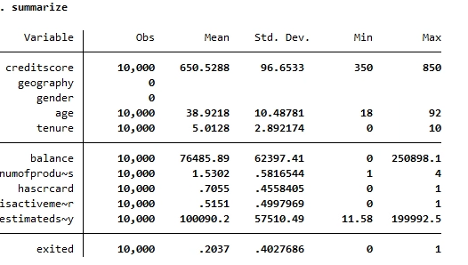
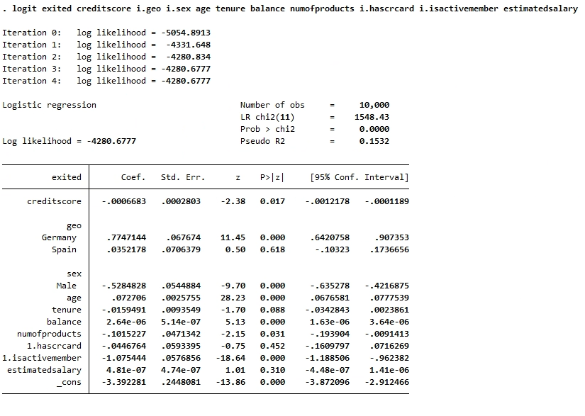
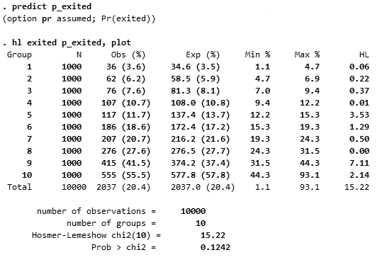
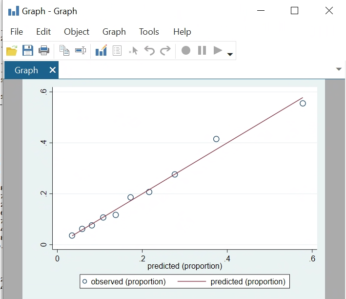
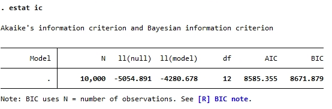
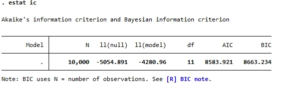
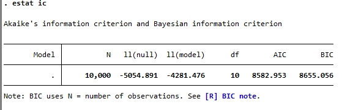
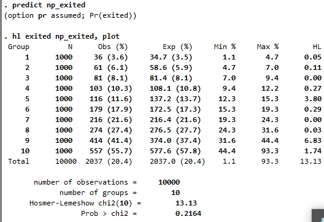
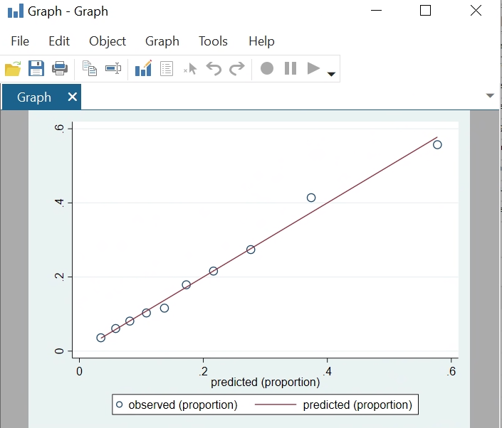

```{r setup, include=FALSE}
knitr::opts_chunk$set(echo = TRUE)
```

## Setup
In Stata, there are built-in functions called
[lfit](https://stats.idre.ucla.edu/stata/webbooks/logistic/chapter3/lesson-3-logis
tic-regression-diagnostics/) and [estat
gof](https://www.stata.com/manuals13/restatgof.pdf) for performing Hosmer-Lemeshow
test. However, in order to make HL plot for model calibration, we will first
install the hl packages from [sealedenvelope](https://www.sealedenvelope.com/).

```
net from https://www.sealedenvelope.com/
net describe hl
net install hl

```

## Loading data
```
import delimited Churn_Modelling_Cleaned.csv
summarize
save churn_data.dta, replace
clear
```
We first load in the data and use `summarize` to produce an overview of the
data

  

## Fitting logistic model
Before we fit an logistic model, we must notice that stata doesn't know how to 
handle string variables for regression. One way to solve this is to use `encode`
command. In our case, we use it to convert variables geography and gender.  
```
use churn_data
encode geography, gen(geo)
encode gender, gen(sex)
```

Then we use `logit` function to built the logistic regression model with
`exited` as response variable and others as predictors.

```
logit exited creditscore i.geo i.sex age tenure balance numofproducts i.hascrcard i.isactivemember estimatedsalary

```
The result is presented below.   



## Hosmer-Lemeshow Test and calibration plot

For a HL test statistics, we can just use `lfit` or `estat gof` commands.
In our case, we will use `hl` command that enables us to create calibration 
plot. Unlike `lfit` or `estat gof`, `hl` command requires us to store predicted 
value in a variable. We will name it `p_exited` here. Then we can use the
command `hl exited p_exited, plot` to obtain the test result and calibration
plot. Note that the `, plot` command is optional.
Below is the result of the HL test and calibration plot.  

  

.   

We see the the test statistics for the HL test is 0.1242 > 0.05, so we failed
to reject null hypothesis, indicating the model is well fitted.
The plot also shows that the observed value(bubbles) are well fitted on the
line.

## Compare with likelihood based approach(AIC)
We will try to use a likelihood based approach(AIC) and backward elimination 
method to do variable selection. Then we will construct an optimized model and 
compare the HL test result with the previous result. The `estat ic` command
helps us to find the AIC for the model. The AIC for our current model is 
8585.355.  
.  

Then we eliminate HasCrCard, which has the highest p-value. The AIC for the new
model is 8583.921.   
  

Proceed this procedure, we eliminate EstimatedSalary and the resulting AIC is 
8582.953.   

  

Now we reached our final model and we will then repeat the process of
performing HL test and calibration plot again.

### HL test and calibration plot for new model
We will first present the result.   
  

  

We can observe that the new statistics become 0.2164, which is an improved
model and coincides with the AIC approach.


